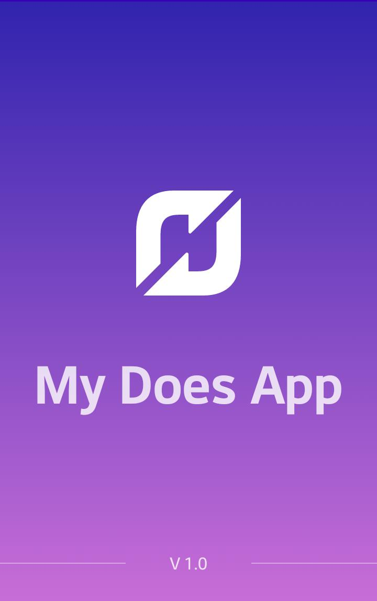
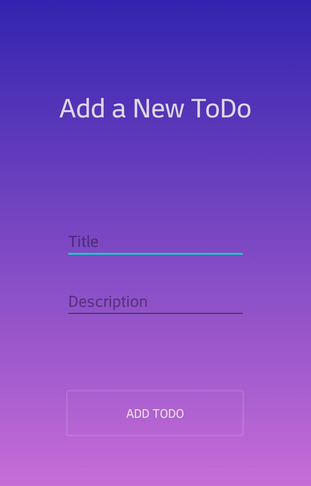

# Sample-ToDo

ToDo App is simple and awesome app to organize your daily tasks. Very easy to use interface. ToDo can help you to make list of your tasks.

We believe that we only focus on our Today and Tomorrow tasks, which is most important. So we made user interface like that so that it can give you a quick view on your day timeline.

# Features of ToDo App 
check box for done/undone
unfinished task list view
overdue tasks view
done task archive view
Editing
search/filter by: text, tag, date range, no date, no tags, doesn't have tag x
sort by date due, priority, create date, modified date
print
drag and drop ordering
integrate with google calendar
calendar date selector in web app
smartphone(iphone, adroid) support
easy to use web interface
desktop or offline version nice to have

# Splash Screen

# Add New ToDo

